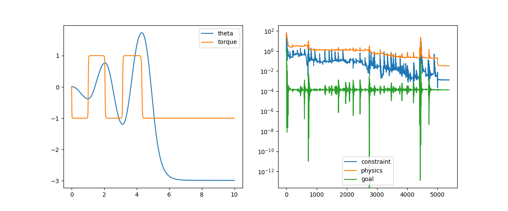
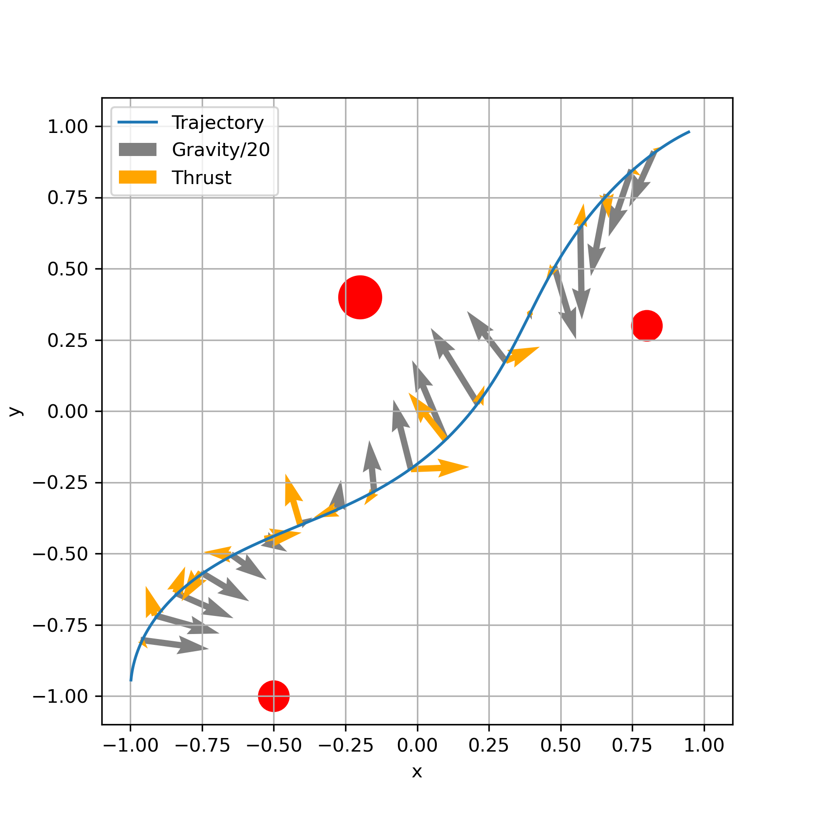
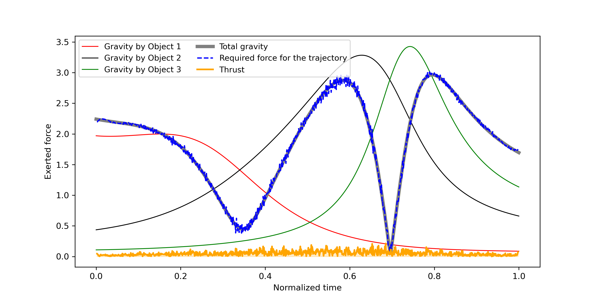

# PINN Blogpost

In this blog post we attempt to reproduce the paper *Solving real-world optimization tasks using physics-informed neural computing*[^X].
The paper's code is [available on GitHub](https://github.com/jaem-seo/pinn-optimization/tree/b65a4982283d46be4c817d8e3157ca68c39ed88c) 
and uses the [DeepXDE](https://github.com/lululxvi/deepxde) library to implement the PINNs.We reproduce three of the examples produced 
in the paper by writing the network in pure PyTorch, and include a [new example](#spaceship-landing) in order to further test the capabilities if the
proposed architecture.


<!-- TOC -->
* [Pendulum](#pendulum)
  * [Existing code](#existing-code)
  * [Own implementation](#own-implementation)
* [Spacecraft Swingby](#spacecraft-swingby)
  * [Paper implementation and existing code](#paper-implementation-and-existing-code)
  * [Own implementation](#own-implementation-1)
* [Shortest Path](#shortest-path)
* [Spaceship Landing](#spaceship-landing)
<!-- TOC -->


## Pendulum

### Existing code

We found that the code used by the developer is flakier than the paper might suggest. In `data/pendulum` the code sets a random seed as 
such:

```python
# Set random seed
seed = 0
np.random.seed(seed)
tf.random.set_seed(seed)
dde.backend.tf.random.set_random_seed(seed)
```

and indeed the code runs well when run like this. However, removing the set seed does not always give good results. Here we present a 
random sampling of X runs with the above lines omitted:


### Own implementation

- Point resampling is important
- learning rates and coefficients are important, and depend on the implementation. For example, learning rates had to be lowered when 
  point resampling wasn't implemented 
- about 1 in X runs actually converges to something nice
- average time for a run
  - (did not have time to optimize this)
- 


## Spacecraft Swingby

### Paper implementation and existing code
In the original paper, this problem is solved using two loss functions, one for the physics (which has the goal loss embedded in it), and one for the boundary conditions (i.e. the constraint loss). The physics and constraint losses are defined from the functions for the thrust, and initial/final positions:


$$
\mathcal{F} = 
\begin{cases}
    \frac{1}{T^2}\frac{d^2x}{dt_N^2} - \sum_{(x_0, y_0, GM_0)} \left[ \frac{-GM_0(x - x_0)}{((x - x_0)^2 + (y - y_0)^2)^{1.5}} \right], \quad x \text{ component}\\
    \frac{1}{T^2}\frac{d^2x}{dt_N^2} - \sum_{(x_0, y_0, GM_0)} \left[ \frac{-GM_0(y - y_0)}{((x - x_0)^2 + (y - y_0)^2)^{1.5}} \right], \quad y \text{ component}
\end{cases}
$$

$$
(x, y) = 
\begin{cases}
    (-1, -1) \text{ at } t_N = 0 \\
    \quad (1, 1) \text{ at } t_N = 1
\end{cases}
$$

The paper's implementation mentions the following configurations to train the network:
- learning rate = $0.001$
- loss weigts = $\{w_{phys}, w_{con}\} = \{1, 1\}$
- Adam optimizer epochs = $2000$
- L-BFGS optimizer until convergence ($1215$ epochs needed)
- $T$ is a trainable parameter that acts as a normalization factor

The paper however omits the method in which the variable $T$ is trained, and this had to be inferred from the existing code written using the [DeepXDE](https://github.com/lululxvi/deepxde) library. As shall be mentioned in the following section, the configuration used by the paper seems to be only valid when using the specific library, as the total loss tends to never decrease enough to obtain accurate results. Looking at the existing code, something that is not mentioned in the paper is the resampling of input values, which occurs every 100 epochs. This method proved useful in reducing the total loss when a plateu was found. Similarly, the trainable parameter $T$ is only updated every 10 epochs, again omitted in the paper (along with any other mention of the training of $T$), though this larger training period did not seem to greatly affect the final results. Given this information, the paper is relatively incomplete for attempting a reprodution of the spacecraft swingby results, however, the provided code was useful in understanding the network architecture and the training steps taken.


### Own implementation

Using the paper's existing code as a starting point, we created our own implementation of the PINN using the pytorch library. The same network architecture was used (1 input, 3 hidden layers with 64 nodes, and 2 outputs), using the $tanh$ activation function for all layers and Glorot normal initialization of parameters. Unlike the paper, a random seed was not selected, somewhat demonstrating a better robustness of out method. The training parameters however differ greatly from the paper. The loss functions weights were updated to  $\{w_{phys}, w_{con}\} = \{1, 10\}$, to ensure that the boundary conditions are met. Without this, the boundary conditions were never met. The learning rate was also increased to $0.004$, in part to account for the larger weights, in order to reduce the loss. The same number of training epochs were used for the Adam optimizer ($2000$), though for the L-BFGS, many more were required (closer to $8000$ to reach convergence). Also, for the latter half of the L-BFGS training, the learning rate was further increased to $0.05$, in order to decrease the loss, while mainting stability in the earlier parts of training. Input point resampling and the training of the variable $T$ were also implemented using the existing code as reference, which helped in having more stability at higher learning rates. 

With this, the spacecraft swingby PINN was trained, and the trajectory of the spacecraft, as well as the thrust exerted by gthe spacecraft and the gravity forces acting on it were plotted. 





Comparing these plots to the ones that ought to be reproduced from the paper (namely Figure 4. of the paper), it seems that the results are quite agreeable, where for most of the trajectory, the thrust required to swing the spacecraft between the bodies is very low. The actual trajectory is also practically the same, where especially at the boundary conditions, the same accuracy is not met. However, it seems that the total loss achieved by our implementation is greater than that of the paper, since the required thrust is higher (not as minimal as the method would lead it to be) and thrust values are noisier. 


## Shortest Path

## Spaceship Landing


[^X] Seo, J. Solving real-world optimization tasks using physics-informed neural computing. Sci Rep 14, 202 (2024). https://doi.org/10.1038/s41598-023-49977-3