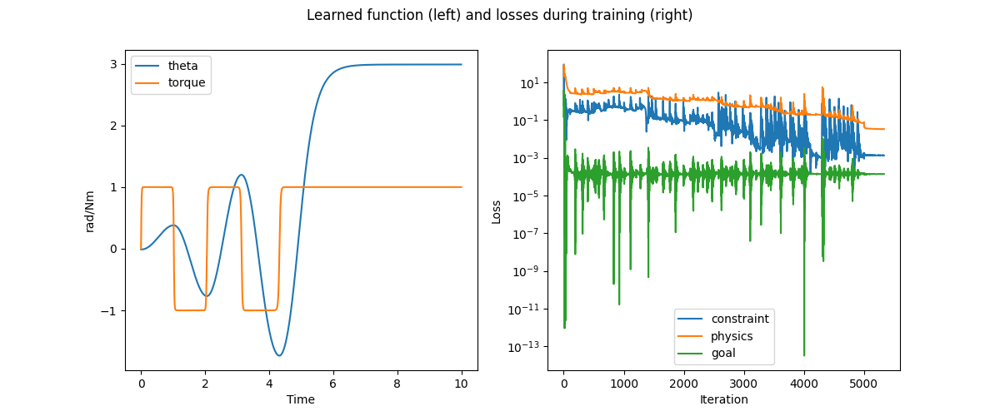
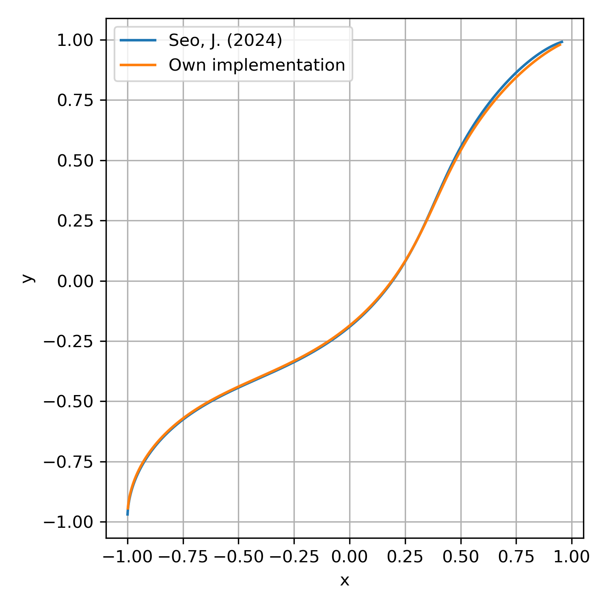
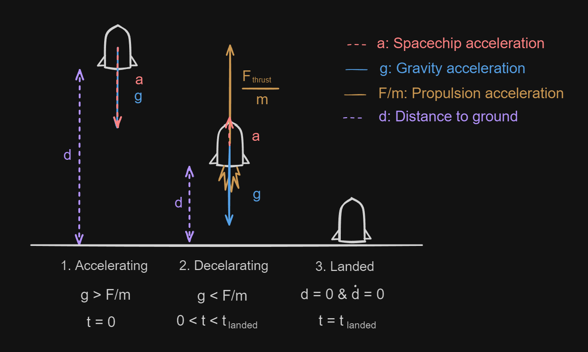
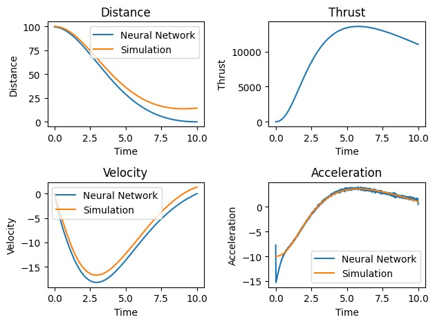
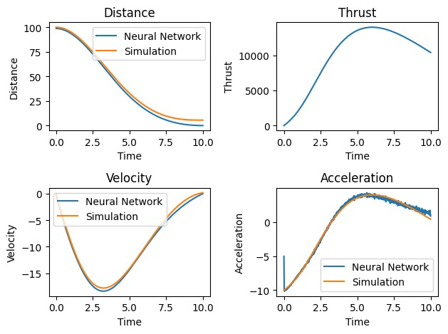

# PINN Blogpost

Authors Group 9:
- Mathijs van Binnendijk (4583957)
- José Cunha (5216087)
- Lucas Van Mol (6059686)
- Nicolas Farjado Ramirez (xxx)


In this blog post we attempt to reproduce the paper *Solving real-world optimization tasks using physics-informed neural computing*[^X].
The paper's code is [available on GitHub](https://github.com/jaem-seo/pinn-optimization/tree/b65a4982283d46be4c817d8e3157ca68c39ed88c) 
and uses the [DeepXDE](https://github.com/lululxvi/deepxde) library to implement the PINNs. We reproduce three of the examples produced 
in the paper by writing the network in pure PyTorch, and include a [new example](#spaceship-landing) in order to further test the 
capabilities if the
proposed architecture.


<!-- TOC -->
- [PINN Blogpost](#pinn-blogpost)
  - [Pendulum](#pendulum)
    - [Existing code](#existing-code)
    - [Own implementation](#own-implementation)
  - [Spacecraft Swingby](#spacecraft-swingby)
    - [Paper implementation and existing code](#paper-implementation-and-existing-code)
    - [Own implementation](#own-implementation-1)
  - [Shortest Path](#shortest-path)
  - [Reproduction on a new example](#reproduction-on-a-new-example)
    - [Method](#method)
      - [Physics](#physics)
      - [Conditions and constraints](#conditions-and-constraints)
      - [Goal](#goal)
      - [Combining all the losses](#combining-all-the-losses)
    - [Results](#results)
    - [A discussion on weights](#a-discussion-on-weights)
    - [Conclusion](#conclusion)
<!-- TOC -->


## Pendulum

In this example, a pendulum is attached to a low-torque actuator, and the PINN has been given the objective to invert the pendulum such that $cos(\theta) = -1$. 
The idea is that the network should learn to swing the pendulum in order to accumulate enough energy for inversion.
The network has one input, time $t$, and two outputs angle $\theta$ and torque $\tau$.
It then acts like a function approximator, with the aim to learn the trajectory over time of the pendulum with the given objective:

$$
f: t \mapsto \theta, \tau
$$

### Existing code

We found that the paper's code is flakier than the paper might suggest. In the author's code (`data/pendulum/main.py`) the code sets a random seed as such:

```python
# Set random seed
seed = 0
np.random.seed(seed)
tf.random.set_seed(seed)
dde.backend.tf.random.set_random_seed(seed)
```

and indeed the code runs well when run like this. However, removing the set seed does not always give good results. Here we present a 
random sampling of X runs with the above lines omitted:


### Own implementation

In our own implementation, we use the paper to implement the PINN in PyTorch, attempting to make minimal use of the author-provided code.
We found that a few details, not explicity mentioned by the paper, were crucial to getting the reimplementation to work.
One such detail is point resampling. Initially, we used a grid-sampling technique, using `np.linspace()`, to sample points between $t_{min}$ and $t_{max}$. 
However, changing this to be a random uniform sampling of points, resampled every 100 iterations, improved the network's ability to converge. 
We did need to make sure that the extremes $t_{min}$ and $t_{max}$ were always included in the sampling, such that the network could efficiently learn the constraints on the initial conditions and on the final objective state.


An example run of our implementation is shown below. We use the same hyperparameters as in the paper, and note that we do not get such a result every time - usually multiple runs are needed before getting a result with sufficiently low loss.



The time to train is within the same order of magnitude as the paper. Of course, this ignores the unfortunate fact that one has to do multiple runs in order to get a satisfying result.


## Spacecraft Swingby

### Paper implementation and existing code
In the paper, the problem of finding the swingby trajectory of a spacecraft that can reach the given destination using the least amount of 
thrust is presented. A spacecraft must fly between a series of astronomical bodies, leveraging the gravity felt due to each body, and 
using thrust to adjust its trajectory to reach a certain final point.
This problem is solved using two loss functions, one for the physics (which has the goal loss embedded in it), 
and one for the boundary conditions (i.e. the constraint loss). The physics and constraint losses are defined from the functions for the 
thrust, and initial/final positions:


$$
\mathcal{F} = 
\begin{cases}
    \frac{1}{T^2}\frac{d^2x}{dt_N^2} - \sum_{(x_0, y_0, GM_0)} \left[ \frac{-GM_0(x - x_0)}{((x - x_0)^2 + (y - y_0)^2)^{1.5}} \right], \quad x \text{ component}\\
    \frac{1}{T^2}\frac{d^2x}{dt_N^2} - \sum_{(x_0, y_0, GM_0)} \left[ \frac{-GM_0(y - y_0)}{((x - x_0)^2 + (y - y_0)^2)^{1.5}} \right], \quad y \text{ component}
\end{cases}
$$

$$
(x, y) = 
\begin{cases}
    (-1, -1) \text{ at } t_N = 0 \\
    \quad (1, 1) \text{ at } t_N = 1
\end{cases}
$$

The paper's implementation mentions the following configurations to train the network:
- learning rate = $0.001$
- loss weigts = $\{w_{phys}, w_{con}\} = \{1, 1\}$
- Adam optimizer epochs = $2000$
- L-BFGS optimizer until convergence ($1215$ epochs needed)
- $T$ is a trainable parameter that acts as a normalization factor

The paper however omits the method in which the variable $T$ is trained, and this had to be inferred from the existing code written 
using the [DeepXDE](https://github.com/lululxvi/deepxde) library. As shall be mentioned in the following section, the configuration used 
by the paper seems to be only valid when using the specific library, as the total loss tends to never decrease enough to obtain accurate 
results. Looking at the existing code, something that is not mentioned in the paper is the resampling of input values, which occurs 
every 100 epochs. This method proved useful in reducing the total loss when a plateu was found. Similarly, the trainable parameter $T$ 
is only updated every 10 epochs, again omitted in the paper (along with any other mention of the training of $T$), though this larger 
training period did not seem to greatly affect the final results. Given this information, the paper is relatively incomplete for 
attempting a reprodution of the spacecraft swingby results, however, the provided code was useful in understanding the network 
architecture and the training steps taken.


### Own implementation

Using the paper's existing code as a starting point, we created our own implementation of the PINN using the pytorch library. The same 
network architecture was used (1 input, 3 hidden layers with 64 nodes, and 2 outputs), using the $tanh$ activation function for all 
layers and Glorot normal initialization of parameters. Unlike the paper, a random seed was not selected, somewhat demonstrating a better 
robustness of out method. The training parameters however differ greatly from the paper. The loss functions weights were updated to      
$\{w_{phys}, w_{con}\} = \{1, 10\}$, to ensure that the boundary conditions are met. Without this, the boundary conditions were never met. 
The learning rate was also increased to $0.004$, in part to account for the larger weights, in order to reduce the loss. The same number 
of training epochs were used for the Adam optimizer ($2000$), though for the L-BFGS, many more were required (closer to $8000$ to reach 
convergence). Also, for the latter half of the L-BFGS training, the learning rate was further increased to $0.05$, in order to decrease 
the loss, while maintaining stability in the earlier parts of training. Input point resampling and the training of the variable $T$ were 
also implemented using the existing code as reference, which helped in having more stability at higher learning rates. 

With this, the spacecraft swingby PINN was trained, and the trajectory of the spacecraft, as well as the thrust exerted by the 
spacecraft and the gravity forces acting on it were plotted. 


Comparing these plots to the ones that ought to be reproduced from the paper (namely Figure 4. of the paper), it seems that the results 
are quite agreeable, where for most of the trajectory, the thrust required to swing the spacecraft between the bodies is very low. The 
actual trajectory is also practically the same, where especially close to the boundary conditions, the same accuracy is not met. However,
it seems that the total loss achieved by our implementation is greater than that of the paper, since the required thrust is higher (not 
as minimal as the method would lead it to be) and thrust values are noisier. 



## Shortest Path

---

## Reproduction on a new example
_by Mathijs van Binnendijk_

In order to see if  PINN architecture proposed would extend to use cases apart from the ones used in the paper, a new example use case was derived. Requirements for the new use case were set to allow for a goal, boundary conditions, and a environment governed by physics equations. The next section will describe this new use case used as an experiment.

### Method
The experiment performed was based around getting the PINN to predict the landing trajectory of a spacecraft in one dimension. A graphical description of the problem can be seen in the following figure.



The PINN takes the time $t$ as an input and as an output it generates the propulsion force $F_{thrust}$ and the distance to ground $d$ for the given input time. Essentially it predicts the decent path of the landing and accompanying thrust required to follow this decent path.
#### Physics
The equation governing the acceleration of the spacecraft can be written down as:

$`\frac{F_{thrust}}{m} − g - \ddot{d} = 0`$

This means we can describe the residual of the governing physics equation by:

$`\mathcal{F}(t, d)= \frac{F_{thrust}(t)}{m} − g - \ddot{d}(t)`$

This can be used to evaluate the physics loss.

$`L_{phys}(d)=\frac1{N_{\Omega}}\sum_{j=1}^{N_{\Omega}}\|\mathcal{F}(t_j;d)\|_2^2\mathrm{~for~}t_j\in\Omega.`$

* $L_{phys}(d)$: This is the physics loss, which quantifies the deviation of the neural network predictions from the governing physics equations.
* $\frac1{N_{\Omega}}\sum_{j=1}^{N_{\Omega}}$: This part calculates the average over a set of samples within the domain $\Omega$. $N_{\Omega}$ represents the number of samples taken within the domain.
* $\| \mathcal{F}(t_j; d) \|_2^2$: This term measures the squared Euclidean norm of the residual function $\mathcal{F}(t_j; d)$ at each sample point $t_j$ within the domain. Here, $\mathcal{F}(t_j; d)$ represents the residual of the governing physics equation at time $t_j$ given by the distance $d$.

#### Conditions and constraints
The initial conditions are given by:

$`\{ d,\dot{d},\ddot{d}, F_{trust} \} = \{ 0,0,-g, 0 \} \; \textup{at} \; t = 0 \; \textup{s}`$

The maximum thrust is limited and cannot be negative meaning $0 \leq  F_{thrust} \leq F_{max}$ . This is not enforced by implementing this boundary in the loss function but by limiting the output range of the network. The initial conditions lead to the following constraint loss function:

$`L_{const} = w_{21} d^{2} + w_{22} \dot{d}^{2} + w_{23} (\ddot{d} + g)^{2} + w_{24} F_{thrust}^{2}\: \textup{at}\:  t = 0 \textup{s}`$

here all instances of $w$ indicate weights.
#### Goal
From an initial state with height $d$, velocity $v$, and acceleration $a$ we would like to end up at ground level ($d = 0$) with no velocity ($\dot{d} = 0$) at time $t_{end}$. This will be considered a successful landing. This leads to the following goal loss function:

$`L_{goal} = w_{31} d^{2} + w_{32} \dot{d}^{2} \: \textup{at}\:  t = t_{end}`$

#### Combining all the losses
Combining the losses lead to the following optimisation problem:

$`\text{argmin}_{}\{w_{\mathrm{phys}}L_{\mathrm{phys}}+w_{\mathrm{con}}L_{\mathrm{con}}+w_{\mathrm{goal}}L_{\mathrm{goal}}\}`$

### Results
The results of the PINN output are given in the figure below. In order to verify the results a simulation was carried out based on the thrust curve the PINN generated and the same initial conditions. 



The results show that the simulated results roughly align with the PINN prediction. However, it is clear that there is still quite a big gap between the predicted distance to the ground and the simulated result. The acceleration plot gives a hint as to why this is potentially the case. Here we can see the predicted downwards acceleration near the beginning of the time domain does not match the simulation. This indicates the network is unable to accurately produce the distance decent at the start of the simulation. Ideally the physics loss function should prevent this initial acceleration error. This did not happen however, likely because the estimation error is averaged over all acceleration values. This means this narrow error peak near the beginning is averaged out and overall does not have a significant influence on the loss value. Increasing the weights for physics loss somewhat elevates this issue but results in worse performance for other evaluated elements such as initial conditions reproduction by the network. A strategy that did work in terms of improving this issue was to make the weights of the physics loss depend on time. Increasing the weights near the beginning of the simulation and decreasing the weights near the end. This yielded the following results where both the acceleration of the network output matched the simulation as well as the initial conditions being approximately correct. Though not perfect, this is also the best result achieved in terms of meeting the goal conditions.



### A discussion on weights
Based on reproducing the results of the paper for a new experiment it became clear the technique of PINN usage for optimisation tasks is promising. However, it also shined a light on some of the limitations of this method. The main limitation seemed to be the amount of weights one is required to set in order to train the PINN successfully. The paper makes it seem like just three weights are required, one for physics, one for initial conditions, and finally one for the goal. During the experience of designing a new experiment it became clear that this is rather optimistic. For this experiment it was the case that one weight was needed for all the sub elements of the losses as well. For example, the constraint loss needed a weight for all the initial conditions, namely distance, velocity, acceleration and force. Not doing this runs the risk of only optimising conditions with overall higher residuals and leaving out he conditions with relatively little influence on the loss. Exacerbating this issue is the possibility of constant weights not being sufficient. For example, weights varying over time had to be used for the physics loss in order to punish the larger errors in estimating the acceleration near the beginning of the simulation. This exposes a different part of the weights issue, namely that multiplying an average of residuals over time with a constant weight is not a always a sufficient approach. Sometimes a variable weight over the domain might be required.

### Conclusion
It is clear that deciding on weights might not be as simple as the problems the paper chooses to discuss would make it seem. However, with proper time put in tuning all different weights, the method proposed in the paper seems to be able to give good results when used on problems other than those discussed in the paper. Whether this promise translates to a larger set of problem types would need further experimentation and validation.

---

[^X] Seo, J. Solving real-world optimization tasks using physics-informed neural computing. Sci Rep 14, 202 (2024). https://doi.org/10.1038/s41598-023-49977-3
